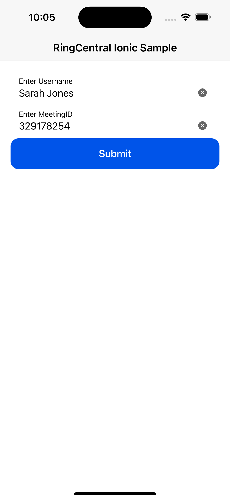
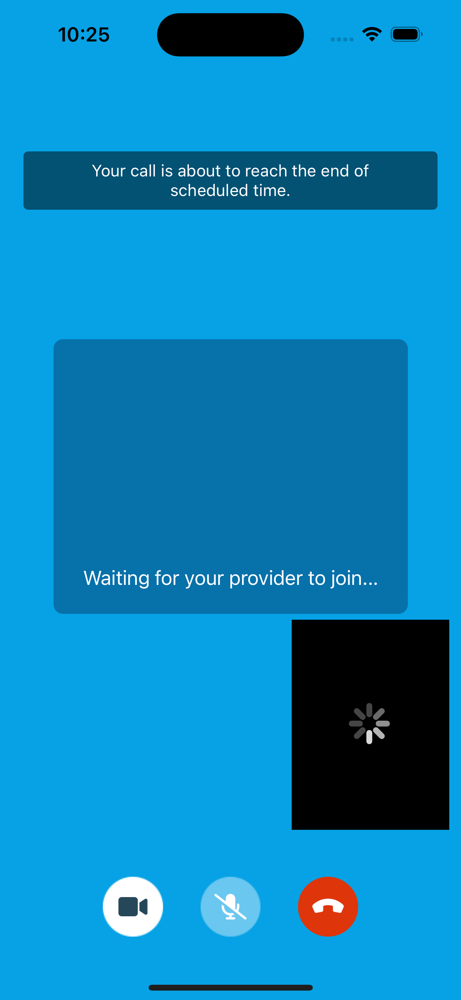

<div align="center">
    <h3 align="center">RingCentral Ionic Integration Sample</h3>
    <p align="center">A sample repository for integrating the native RingCentral SDK with Ionic React.</p>
</div>

<!-- USAGE INSTRUCTIONS -->

## Usage Instructions

### Prerequisites

1. Update the necessary credentials in the [.env](/.env) file.
2. In the root folder, Run
   ```sh
   npm install
   ionic cap sync
   ```

### Build app on iOS simulator

3. Install RingCentral Native SDK for iOS but running these commands:
    ```sh
    # Go to 'ios/app' folder
    cd ios/app

    # Install all pod library in Podfile
    pod install
    ```
4. Go back to root folder then run these commands:
   ```sh
   # Go back to root folder
   cd ../..

   # Serve ionic app to ios simulator
   npm run ios

   ```

### How to use

5. Enter your username and an existing meeting ID. 
6. Tap the 'Join Meeting' button to open the meeting.

### Preview
1. Enter meeting ID
<div align="center">
    
</div>

2. Active meeting
<div align="center">
    
</div>

## Integration Overview
Please refer this the document for more detail: [RingCentral Integration Overview](./doc/integration_guide.md)

## Code Walkthrough
- iOS: [RingCentral Ionic Integration Code Walkthrough for iOS](./doc/ios_coding_walkthrough.md)