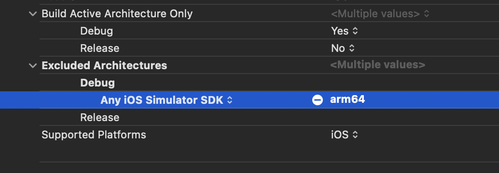
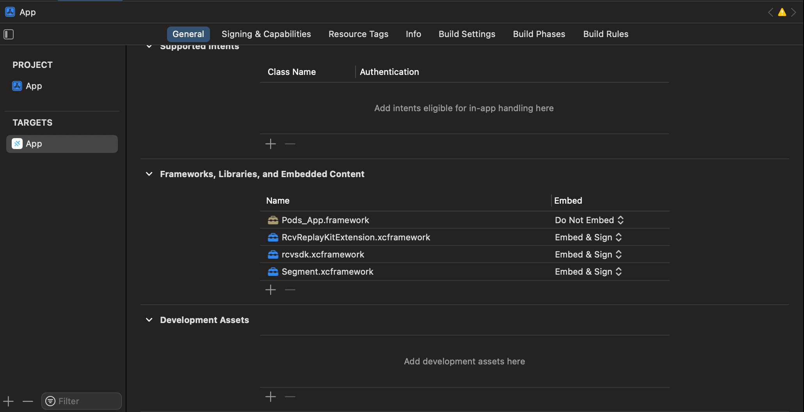

# RingCentral Ionic Integration

This is a sample repo for integrate native RingCentral SDK in Ionic React

## Running Guied

### Perquisite

1. Update necessary credentials in file [.env](/.env)
1. In root folder, Run `npm install`
1. Then Run `ionic cap sync`

### Run ios app

3. Go to ios App folder: `cd ios/app`
4. Run: `pod install`
5. `cd ../..`
6. `npm run ios`

# Integration process

## General setup

1. Setup Custom Native Code follow Ionic Official Document
   1. ios: https://capacitorjs.com/docs/ios/custom-code
   2. Android: https://capacitorjs.com/docs/android/custom-code
2. Create 2 functions
   1. `initRingCentral`: Setup RingCentral credential
   2. `joinMeeting`: Join meeting with meeting id

## Setup iOS with RingCentral

1. Install Ringcentral-Video-SDK, in Podfile add: `pod 'Ringcentral-Video-SDK', '0.14.4'`

```
   # Podfile
   target 'App' do
  capacitor_pods
  # Add your Pods here
   pod 'Ringcentral-Video-SDK', '0.14.4'
   end

   post_install do |installer|
  installer.pods_project.build_configurations.each do |config|
    config.build_settings["EXCLUDED_ARCHS[sdk=iphonesimulator*]"] = "arm64"
  end
  assertDeploymentTarget(installer)
end
```

2. Run `pod install` in ios/app to install Ringcentral-Video-SDK
3. Exclude architect: arm64 in
   
4. Add RingCentral to Frameworks, Libraries, and Embedded Content



5. Create plugin method `initRingCentral`

```swift
    @objc public func initRingCentral(_ call: CAPPluginCall) {
        DispatchQueue.main.async{
            guard let clientId = call.getString("clientId") else {
                call.reject("Missing Client ID")
                return
            }

            guard let clientSecret = call.getString("clientSecret") else {
                call.reject("Missing Client Secret")
                return
            }

            RcvEngine.create(clientId, clientSecret: clientSecret, isShareUsageData: false)

            print("debug -\(#function)")

            call.resolve(["status": "RingCentral initialized"])
        }

    }
```

1. Call `initRingCentral` when app load. For this sample code, it will be called in [Home.tsx](src/pages/Home.tsx)
2. Create plugin method `joinMeeting`

```swift
     @objc public func joinMeeting(_ call: CAPPluginCall) {
        DispatchQueue.main.async {
            guard let meetingId = call.getString("meetingId") else {
                call.reject("Missing meetingId")
                return
            }

            guard let apptEndTime = call.getDate("apptEndTime") else {
                call.reject("Missing meetingId")
                return
            }

            guard let userName = call.getString("userName") else {
                call.reject("Missing username")
                return
            }

            print("debug -\(#function): \(meetingId)")

            let meetingVC = MeettingViewController(meetingId, apptEndTime, userName)
            meetingVC.modalPresentationStyle = .overFullScreen
            meetingVC.onDismiss = { manualLeave in
                call.resolve([ "isManualLeave": manualLeave ])
            }
            meetingVC.onError = { message in
                call.reject(message)
            }
            self.bridge?.viewController?.presentFromRight(meetingVC)
        }
    }
```

3. Check [InputForm.tsx](src/pages/InputForm.tsx) for how to use `joinMeeting`
# ringcrentral-ionic
