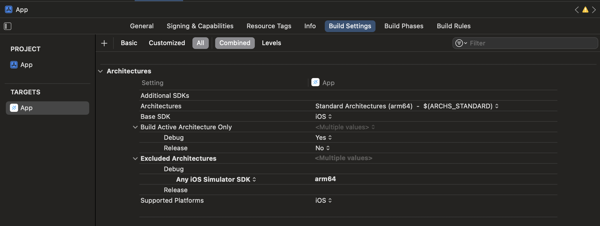
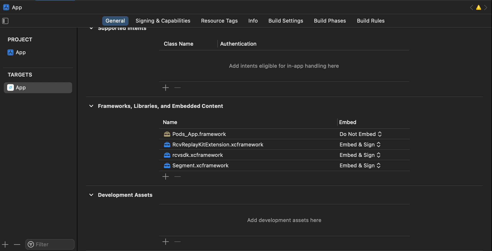
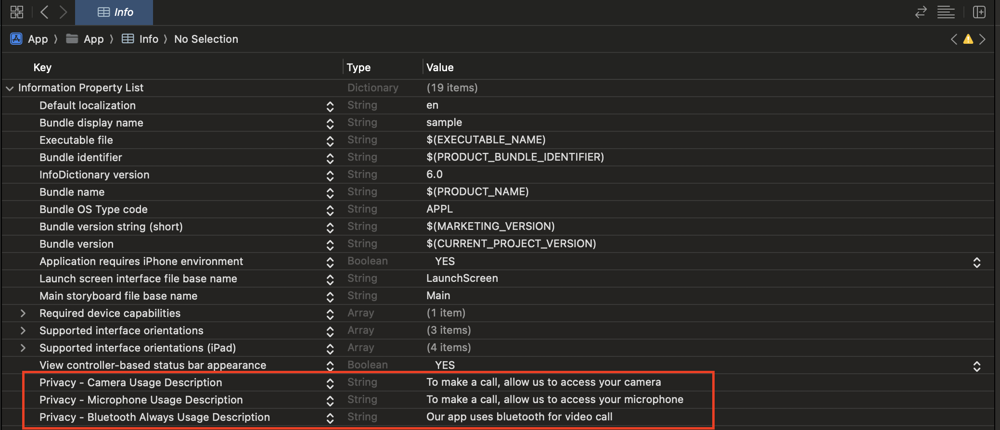

<div align="center">
    <h3>RingCentral Ionic Integration Overview</h3>
    <p>A brief guide on how to integrate the RingCentral SDK with Ionic.</p>
</div>

# Summary

To integrate the RingCentral Native SDK with Ionic, we follow its guidelines to run native code by implementing a **custom plugin for both iOS and Android**. 
In summary, you'll create a custom plugin with a `joinMeeting` method that `opens a native view to handle the RingCentral meeting functionality`.

## Setup RingCentral with Ionic iOS

### Configure project

1. To install the RingCentral Video SDK, update the `Podfile` with the following code:
    ```ruby
    target 'App' do
    capacitor_pods
    # Add your Pods here
    pod 'Ringcentral-Video-SDK', '0.14.4'
    end

    post_install do |installer|
    installer.pods_project.build_configurations.each do |config|
        config.build_settings["EXCLUDED_ARCHS[sdk=iphonesimulator*]"] = "arm64"
    end
    assertDeploymentTarget(installer)
    end
    ```
2. Navigate to the ios/app directory and run `pod install` to install the RingCentral Video SDK.
3. Configure the app to exclude the arm64 architecture as shown in the image.
   
4. Add RingCentral to Frameworks, Libraries, and Embedded Content
   
5. Add permission in `Info.plist`
   

### Setup iOS Native Code to run RingCentral SDK
0. Please follow this guide to set up a custom native plugin in iOS: [Custom Native iOS Code](https://capacitorjs.com/docs/ios/custom-code).
1. Create plugin method `initRingCentral`

    ```swift
    @objc public func initRingCentral(_ call: CAPPluginCall) {
        DispatchQueue.main.async{
            guard let clientId = call.getString("clientId") else {
                call.reject("Missing Client ID")
                return
            }

            guard let clientSecret = call.getString("clientSecret") else {
                call.reject("Missing Client Secret")
                return
            }

            RcvEngine.create(clientId, clientSecret: clientSecret, isShareUsageData: false)

            print("debug -\(#function)")

            call.resolve(["status": "RingCentral initialized"])
        }

    }
    ```
    Call `initRingCentral` when app load. For this sample code, it will be called in [Home.tsx](src/pages/Home.tsx)
2. Create plugin method `joinMeeting`

    ```swift
     @objc public func joinMeeting(_ call: CAPPluginCall) {
        DispatchQueue.main.async {
            guard let meetingId = call.getString("meetingId") else {
                call.reject("Missing meetingId")
                return
            }

            guard let apptEndTime = call.getDate("apptEndTime") else {
                call.reject("Missing meetingId")
                return
            }

            guard let userName = call.getString("userName") else {
                call.reject("Missing username")
                return
            }

            let meetingVC = MeetingViewController(meetingId, apptEndTime, userName)
            meetingVC.modalPresentationStyle = .overFullScreen
            meetingVC.onDismiss = { manualLeave in
                call.resolve([ "isManualLeave": manualLeave ])
            }
            meetingVC.onError = { message in
                call.reject(message)
            }
            self.bridge?.viewController?.presentFromRight(meetingVC)
        }
    }
    ```
3. Check [InputForm.tsx](src/pages/InputForm.tsx) for how to use `joinMeeting`

## Setup RingCentral with Ionic Android (WIP)